# CODE 原创项目 — 2026-06-28 完整开发聊天记录

> 本文档为 **2026-06-28** 全天 Cursor AI  Pair Programming 会话的详尽整理，涵盖：  
> 每一条用户诉求 → AI 执行动作 → 产出文件 → 遇到的问题 → 修复方案 → 截图证据。  
>  
> 配套技术文档：[CODE原创项目-开发教程.md](./CODE原创项目-开发教程.md)

---

## 目录

- [一、会话统计与项目成果](#一会话统计与项目成果)
- [二、环境与运行参数](#二环境与运行参数)
- [三、完整对话流水（按时间）](#三完整对话流水按时间)
- [四、分模块详尽实现记录](#四分模块详尽实现记录)
- [五、数据库与配置清单](#五数据库与配置清单)
- [六、API 接口完整清单](#六api-接口完整清单)
- [七、问题排查全记录（13 项）](#七问题排查全记录13-项)
- [八、截图全索引（13 张）](#八截图全索引13-张)
- [九、Git / GitHub / 生产部署](#九git--github--生产部署)
- [十、源码文件全清单](#十源码文件全清单)
- [十一、待办与风险提示](#十一待办与风险提示)

---

## 一、会话统计与项目成果

### 1.1 会话规模

| 指标 | 数值 |
|------|------|
| 日期 | 2026-06-28（周日） |
| 有效用户消息 | 约 44 条（含重复确认、截图） |
| 开发时段 | 约 12:38 — 22:00+（UTC+8） |
| 用户截图 | 13 张（已归档至 `docs/chat-images/`） |
| 后端 Java 类 | 73 个 |
| 前端核心 Vue/TS 文件 | 20+ 个 |
| Git 本地提交 | 2 个 commit |
| 开发教程 | 初版 1037 行 → 整理版 647 行 |
| 聊天记录文档 | 本文档（详尽版） |

### 1.2 从零到一的模块清单

| 序号 | 模块 | 完成度 | 关键交付物 |
|------|------|--------|------------|
| 1 | 全局基础布局 | ✅ 100% | BasicLayout、GlobalHeader、GlobalFooter |
| 2 | 用户模块 | ✅ 100% | Session 鉴权、CRUD、AOP 权限、前后端页面 |
| 3 | AI 代码生成（HTML/多文件） | ✅ 100% | LangChain4j、DeepSeek、门面/模板方法、落盘 |
| 4 | 应用管理 | ✅ 100% | app 表、用户/管理员接口、HomeView/AppChatView |
| 5 | SSE 流式输出 | ✅ 100% | SseEmitter、fetch SSE、命名事件 |
| 6 | 实时预览 | ✅ 100% | 两段式 iframe、StaticResourceConfig |
| 7 | 在线部署（本地） | ✅ 100% | deploy 接口、/static 映射 |
| 8 | 对话历史 | ✅ 100% | chat_history 表、游标分页、AI 记忆 |
| 9 | Redis 分布式 Session | ✅ 100% | spring-session-data-redis、database 1 |
| 10 | Vue3 工程项目生成 | ✅ 100% | Agent 工具调用、npm build、SSE 扩展 |
| 11 | 生产部署脚本 | ⚠️ 70% | deploy.py 已上传，远程服务未完全启动 |
| 12 | GitHub 上传 | ⚠️ 50% | 远程仓库已创建，push 未完成 |
| 13 | 文档整理 | ✅ 100% | 开发教程 + 聊天记录 |

### 1.3 技术栈最终形态

```
前端：Vue 3 Composition API + TS + Vite + Ant Design Vue + Pinia + Axios
后端：Spring Boot 3.5 + Java 21 + MyBatis Flex + LangChain4j + AOP
数据：MySQL 8（student_pro）+ Redis 7（Session db=1）
AI：DeepSeek Chat（OpenAI 兼容 API，环境变量 DEEPSEEK_API_KEY）
部署：Nginx + systemd + Docker Compose（MySQL/Redis）
```

---

## 二、环境与运行参数

### 2.1 本地开发环境

| 项目 | 值 |
|------|-----|
| 工作目录 | `D:\cursor-workspace\java_student_pro` |
| JDK | 21（`JAVA_HOME=D:\work\jdk21`） |
| 前端端口 | 5173 |
| 后端端口 | 8123 |
| API 前缀 | `/api` |
| MySQL 容器 | `mysql-container`，库 `student_pro`，`root/root` |
| Redis 容器 | `redis-custom`，6379，**Session 使用 database 1** |
| 测试账号 | `testuser` / `12345678` |
| 管理员 | 数据库 `user_role = 'admin'` |

### 2.2 生产环境（规划/部分部署）

| 项目 | 值 |
|------|-----|
| 服务器 IP | 124.70.195.81 |
| 部署目录 | `/opt/code-student-pro` |
| 访问地址 | http://124.70.195.81/ |
| 后端 profile | `prod`（8123，Nginx 反代 `/api`） |
| 前端 API | `client/.env.production` → `VITE_API_BASE_URL=http://124.70.195.81/api` |

> **安全提示：** 会话中曾明文提供服务器密码与 GitHub Token，**必须轮换**，且不得写入 Git。

### 2.3 代码落盘目录约定

| 用途 | 路径 |
|------|------|
| AI 生成源码 | `{user.dir}/tmp/code_output/{codeGenType}_{appId}/` |
| 部署产物 | `{user.dir}/tmp/code_deploy/{deployKey}/` |
| Vue 工程预览 | `.../vue_project_{appId}/dist/index.html` |
| HTML 预览 | `.../html_{appId}/index.html` |

---

## 三、完整对话流水（按时间）

以下按 **用户每条有效消息** 整理：用户说了什么 → AI 做了什么 → 结果如何。

---

### 阶段 A：全局布局（12:38 — 12:42）

#### 对话 A-1｜12:38

**用户原话：**

> 你是一位前端程序员专家，帮我给项目生成通用的全局基础布局……  
> 1）`layouts/BasicLayout.vue`，在 `App.vue` 引入  
> 2）移除 `main.css` 及引用  
> 3）上中下布局，Ant Design Vue Layout  
> - 上方：`GlobalHeader`（logo.png + 标题 + Menu 配置 + 登录按钮）  
> - 中间：RouterView  
> - 下方：`GlobalFooter`（版权 CODE原创项目 by ZhenQ，链接 https://www.baidu.cn）

**AI 动作：**

- 扫描 `client/` 目录，确认 Vue 3 + ant-design-vue 已安装
- 新建 `layouts/BasicLayout.vue`（Layout + Header + Content + Footer）
- 新建 `components/GlobalHeader.vue`（Menu 配置驱动、`router-link`）
- 新建 `components/GlobalFooter.vue`（固定底部、外链）
- 精简 `App.vue` 为仅渲染 BasicLayout
- 修改 `main.ts`：移除 `./assets/main.css`，引入 `ant-design-vue/dist/reset.css`
- 生成/补充 `logo.png`

**产出文件：**

- `client/src/layouts/BasicLayout.vue`
- `client/src/components/GlobalHeader.vue`
- `client/src/components/GlobalFooter.vue`
- `client/src/App.vue`（重写）
- `client/src/main.ts`（修改）

---

#### 对话 A-2｜12:42

**用户原话：**

> 新增 layouts/BasicLayout.vue、components/GlobalHeader.vue、components/GlobalFooter.vue，同时把 App.vue 和 main.ts 精简为全局布局入口，并移除默认样式文件引用

**AI 动作：** 确认并完成上述文件创建与入口改造（与 A-1 衔接）。

**结果：** ✅ 全局布局可用，访问首页可见上中下结构。

---

### 阶段 B：用户模块（12:51 — 13:48）

#### 对话 B-1｜12:51

**用户原话：** 完整用户模块需求分析（注册、登录、注销、当前用户、权限控制、管理员管理用户）+ MyBatis Flex + 代码生成器。

**AI 动作（后端）：**

- 设计 `user` 表（`create_table.sql`）
- 实体 `User`、DTO（Register/Login/Query/Update）、VO（LoginUserVO/UserVO）
- `UserService` / `UserServiceImpl`：MD5+盐加密、Session 存登录态
- `UserController`：RESTful 接口
- 公共层：`BaseResponse`、`ErrorCode`、`ResultUtils`、`BusinessException`、`GlobalExceptionHandler`
- MyBatis Flex 集成、`UserMapper`
- 代码生成器 `MyBatisFlexCodeGenerator`

**AI 动作（前端）：**

- `stores/loginUser.ts`（Pinia）
- `request.ts`（Axios + withCredentials + 401 拦截）
- `UserLoginView`、`UserRegisterView`、`UserManageView`
- 路由守卫 `meta.access`

---

#### 对话 B-2｜12:55

**用户原话：**

> 登录用 Session，mysql 数据库，RestFUL api 开发规范

**AI 动作：** 确认 Session 方案（`HttpSession` + Cookie），MySQL 持久化，统一 `/api` 前缀与 REST 风格路径。

---

#### 对话 B-3｜13:10

**用户原话：** 提供 Spring Boot 配置与依赖清单：

- `server.port: 8123`，`context-path: /api`
- lombok 1.18.36、hutool 5.8.38、knife4j 4.4.0、spring-boot-starter-aop
- `@EnableAspectJAutoProxy(exposeProxy = true)`

**AI 动作：** 写入 `application.yml`、`pom.xml`，配置 Knife4j 文档地址 `/api/doc.html`。

---

#### 对话 B-4｜13:12

**用户原话：**

> 基于 AOP 的权限校验注解 `@AuthCheck(mustRole = "admin")` 加上，替换 Controller 里手写的 checkAdmin

**AI 动作：**

- 新建 `@AuthCheck` 注解
- 新建 `AuthInterceptor`（AOP 切面，读取 Session 用户角色）
- 管理员接口改用 `@AuthCheck(mustRole = "admin")`，删除手写校验

**产出：** `annotation/AuthCheck.java`、`aop/AuthInterceptor.java`

---

#### 对话 B-5｜13:15 — 13:17

**用户原话：**「可以运行了吗」→「docker 运行了，有 mysql」（发送两次）

**AI 动作：**

- 检查 Docker MySQL 容器
- 执行建表 SQL（docker cp + mysql 命令）
- 启动 Spring Boot（`mvnw spring-boot:run`）
- 启动前端 `npm run dev`

**结果：** ✅ 后端 8123、前端 5173 可访问。

---

#### 对话 B-6｜13:42

**用户原话：** https://mybatis-flex.com/zh/intro/getting-started.html

**AI 动作：** 按 MyBatis Flex 官方文档修正 starter 为 `mybatis-flex-spring-boot3-starter`，修复列名映射（snake_case）。

---

#### 对话 B-7｜13:48

**用户原话：**「用户名和密码是多少」

**AI 回复：**

- 测试账号：`testuser` / `12345678`（需先注册或已存在）
- MySQL：`root` / `root`
- 管理员：数据库改 `user_role`

---

### 阶段 C：AI 代码生成（14:05 — 14:33）

#### 对话 C-1｜14:05

**用户原话：** AI 应用生成完整教学需求：

- LangChain4j + DeepSeek
- 两种模式：HTML 单文件、多文件（html/css/js）
- 结构化输出、门面模式落盘
- SSE 流式（LangChain4j + Reactor 推荐）

**AI 动作（后端）：**

- `pom.xml` 添加 langchain4j 依赖
- `application.yml` 配置 DeepSeek API（`${DEEPSEEK_API_KEY}`）
- `AiCodeGeneratorService`（@AiService 接口）
- `AiCodeGeneratorFacade`（门面编排）
- `CodeParser`（Markdown 代码块解析）
- `HtmlCodeFileSaverTemplate` / `MultiFileCodeFileSaverTemplate`（模板方法）
- `CodeFileSaverExecutor`（路由保存器）
- `CodeGenTypeEnum`：HTML、MULTI_FILE
- 系统提示词：`codegen-html-system-prompt.txt`、`codegen-multi-file-system-prompt.txt`
- `AiCodeGeneratorController`：同步 + SSE 接口

**落盘规则：** `tmp/code_output/{type}_{appId}/`

---

### 阶段 D：应用管理 + 原型（14:33 — 14:51）

#### 对话 D-1｜14:33（发送 2 次）

**用户原话：** 应用管理完整需求（用户 CRUD、精选、部署、管理员接口）+ 三张原型图占位。

**AI 动作（后端）：**

- `create_app_table.sql` → 表 `app`
- 实体 `App`、DTO、VO、`AppMapper`、`AppServiceImpl`
- `AppController` 全套用户/管理员接口

**AI 动作（前端）：**

- `HomeView`：Hero「一句话 🐱 呈所想」+ 输入框 + 快捷标签
- 「我的作品」「精选案例」卡片网格（`AppCard.vue`）
- `AppChatView`：左右分栏骨架
- 创建流程：输入 → `addApp` → 跳转 `/app/chat/{id}?auto=1`

---

#### 对话 D-2｜14:41

**用户原话：**（仅发送 3 张截图，无文字）

**截图内容：** NoCode 平台原型参考（见 [八、截图](#八截图全索引13-张) 图 1–3）

**AI 动作：** 按 NoCode 交互风格调整 HomeView / AppChatView 布局。

---

#### 对话 D-3｜14:51

**用户原话：**

> 继续把 在线部署接口 + 管理员应用管理页 补齐

**AI 动作：**

- 后端 `POST /app/deploy`：复制 code_output → code_deploy，生成 deployKey
- `StaticResourceConfig`：`/static/**`、`/preview/**`
- 前端 `AppManageView`：管理员搜索、编辑、设精选、删除
- `AppChatView` 顶部「部署」按钮

---

### 阶段 E：运行调试 + SSE + 预览（15:06 — 15:45）

#### 对话 E-1｜15:06

**用户原话：**「后端运行了吗」

**AI 动作：** 检查进程/端口，确认或重启后端。

---

#### 对话 E-2｜15:09

**用户原话：**「重新运行」

**AI 动作：** 停止旧进程，`mvnw spring-boot:run` 重启后端。

---

#### 对话 E-3｜15:12

**用户原话：**「前端没有流式输出」+ **截图 4**

**现象（截图）：** 用户输入「电商运营后台」，AI 回复区空白，无 token 逐字出现。

**原因：** 原用 `EventSource`，不支持 POST / 自定义 Header / 带 Cookie 的 SSE。

**AI 修复：**

- 新建 `client/src/utils/sse.ts`：`fetch` + `ReadableStream` 解析 SSE
- `AppChatView` 改用新 SSE 工具
- 后端确认 `SseEmitter` 发送（非 Flux，避免客户端断开取消 AI 流）

**结果：** ✅ 左侧可见流式文字输出。

---

#### 对话 E-4｜15:31 附近

**用户原话：**「实时查看应用效果」→「继续」

**AI 动作：** 实现两段式预览：

| 阶段 | 实现 |
|------|------|
| 生成中 | `iframe srcdoc`，流式 HTML 注入 |
| 生成完成 | `iframe src` → `/api/preview/{type}_{appId}/index.html` |

---

#### 对话 E-5｜无时间戳

**用户原话：**「生成失败」+ **截图 5**

**现象：** 生成中断，提示 closed / 失败。

**AI 修复：**

- 后端 `SseEmitter` 与 AI 流解耦
- 流异常时 `doOnError` 仍落盘已生成部分
- 错误事件名改为 `gen-error`（避免与 EventSource 原生 error 冲突）
- 失败时 `saveErrorMessage` 写入对话历史

---

#### 对话 E-6｜无时间戳

**用户原话：**（仅截图）**截图 5 补充**

---

#### 对话 E-7｜无时间戳

**用户原话：**「网页右侧展示显示乱码」+ **截图 6**

**现象（截图）：** 右侧 iframe 显示 Spring Boot Whitelabel Error Page：

```
NoResourceFoundException: No static resource html_2.
status=404
```

左侧却能看到生成的 HTML/JS 源码（电商运营后台）。

**原因：** 预览 URL 使用目录形式 `/preview/html_2/`，Windows 下静态资源解析失败。

**AI 修复：**

- 预览 URL 改为 `/preview/html_2/index.html`
- 修正 `StaticResourceConfig` 资源处理器
- `AppChatView.buildPreviewUrl()` 统一拼接

**结果：** ✅ 右侧正常渲染网页。

---

#### 对话 E-8｜无时间戳

**用户原话：**

> 可以将所有的聊天记录导出 md 教程吗

**AI 动作：** 首次创建 `docs/CODE原创项目-开发教程.md`（初版，涵盖至应用管理/SSE/预览）。

---

### 阶段 F：对话历史 + Redis Session（晚间）

#### 对话 F-1｜晚间（发送 2 次相同内容）

**用户原话：** 对话历史模块完整需求：

- 持久存储 user/ai/error 消息
- 应用级隔离，删除应用级联删历史
- 游标分页（最新 10 条，向上加载更多）
- 对话记忆注入 prompt（增量改进而非重写）
- Redis 分布式 Session

**AI 动作（后端）：**

- `create_chat_history_table.sql`
- 实体 `ChatHistory`、`ChatMessageTypeEnum`（USER/AI/ERROR）
- `ChatHistoryMapper`、`ChatHistoryServiceImpl`
- 游标分页 `listHistoryByCursor` → `ChatHistoryCursorPageVO`
- `buildPromptWithMemory(appId, message)` — 注入最近 20 条
- 集成 `/app/chat/gen/code`：先记忆 → 再 saveUserMessage → 流式生成 → saveAiMessage/saveErrorMessage
- `AppServiceImpl.removeById` 级联 `deleteByAppId`
- `RedisSessionConfig` + `spring-session-data-redis`
- Redis **database: 1**（避免与其他项目 db0 Session 冲突）

**AI 动作（前端）：**

- `listChatHistory` API（`client/src/api/app.ts`）
- `AppChatView`：`onMounted` 加载历史、「加载更早的消息」、error 红色气泡
- 有历史时自动加载预览 URL

**接口：** `GET /app/chat/history?appId=&pageSize=10&lastId=`

---

#### 对话 F-2

**用户原话：**

> 需要把该模块写入 docs/CODE原创项目-开发教程.md

**AI 动作：** 教程新增第 8 章「对话历史模块」，更新目录、FAQ、附录时间线。

---

### 阶段 G：Vue3 工程项目生成（晚间）

#### 对话 G-1｜晚间

**用户原话：** 工程项目生成完整设计文档 + **4 张截图**：

- 方案 1：Markdown 解析
- 方案 2：工具调用（saveFile）
- 方案 3：Agent 模式 + 思考 UI
- 参考 NoCode/秒哒/Coze，以 Vue3+Vite 为例

**AI 动作（文档）：**

- 教程新增第 12 章（方案对比、架构图、实现清单）
- 新建 `codegen-vue-project-system-prompt.txt`

---

#### 对话 G-2

**用户原话：**「继续」

**AI 动作（全栈实现）：**

**后端新增 11 个类：**

| 类 | 作用 |
|----|------|
| `CodeGenTypeEnum.VUE_PROJECT` | 第三种模式枚举值 `vue_project` |
| `VueProjectContext` | ThreadLocal 传递 appId |
| `VueProjectFileTool` | @Tool：saveFile / readFile / listFiles |
| `VueProjectAgentService` | LangChain4j Agent 流式接口 |
| `VueProjectAgentConfig` | 独立 Agent 注册 |
| `VueProjectCodegenExecutor` | SSE 事件编排 |
| `VueProjectBuildService` | npm install + npm run build |
| `VueProjectPathUtils` | 工程/dist 路径 |
| `VueProjectPackageNormalizer` | 修正 npm 依赖版本 |
| `VueProjectPreviewPathFixer` | vite base + dist 相对路径 |
| `VueProjectStreamCallback` | 流式回调接口 |

**AppController 改造：**

- `codeGenType == vue_project` 时走 Agent 分支
- SSE 事件：`tool-start`、`build-log`、`preview-ready`、`gen-error`、`done`
- `deployApp`：Vue 模式复制 `dist/` 目录

**前端改造：**

- `HomeView`：`a-segmented` 选择 html / multi_file / vue_project
- `types.ts`：`CODE_GEN_TYPE.VUE_PROJECT`、`AppAddRequest.codeGenType`
- `sse.ts`：支持命名事件回调
- `AppChatView`：工具进度、构建日志、Vue 预览 URL

---

#### 对话 G-3

**用户原话：**「运行」

**AI 动作：** 启动 MySQL、Redis、后端、前端，给出访问地址与测试账号。

---

#### 对话 G-4

**用户原话：**「后端没有运行吗」（原文「云心」为 typo）

**AI 动作：** 检查并重启 Spring Boot 进程。

---

#### 对话 G-5

**用户原话：**「vue工程生成前端，生成后的网页展示为乱码」+ **截图 10**

**现象（截图）：** 左侧显示 `package.json` JSON 内容；右侧 Spring 404：

```
No static resource vue_project_4/dist/index.html
```

**原因：**

1. 工具调用 JSON 被当作聊天文字显示（乱码感）
2. dist 未构建或路径错误
3. Vite 默认绝对路径导致 iframe 预览空白

**AI 修复：**

- 过滤流式输出中的 tool-call JSON 片段
- `VueProjectPackageNormalizer`：修正 `@ant-design/icons-vue@^7.0.2` → `^7.0.1`
- `VueProjectPreviewPathFixer`：构建前 patch `vite.config.ts` 加 `base:'./'`；构建后 patch `dist/index.html` 为相对路径
- 发送 `preview-ready` 事件后再加载 iframe

---

#### 对话 G-6

**用户原话：**「重启后端」

**AI 动作：** 重启 `mvnw spring-boot:run` 加载新 Vue 相关类。

---

#### 对话 G-7

**用户原话：**「出错」+ **截图 11**

**现象：** npm build 失败或工具调用异常（icons 版本不存在等）。

**AI 修复：** PackageNormalizer + 提示词固定依赖版本列表。

---

#### 对话 G-8

**用户原话：**「右侧没有显示」+ **截图 12**

**现象（截图）：** 构建日志显示 `3744 modules transformed`、dist 文件大小正常，但右侧 iframe **空白**；AI 文字提示「工程上下文未初始化，无法 readFile/writeFile」。

**原因：** 第二轮对话时 `VueProjectContext.appId` 丢失（ThreadLocal 未跨线程/子线程传递）。

**AI 修复：**

- `VueProjectContext` 改用 `InheritableThreadLocal`
- `VueProjectFileTool` 增加 `BOUND_APP_IDS` 静态绑定兜底
- 前端：仅在收到 `preview-ready` 后加载 iframe；`gen-error` 时不触发预览

---

### 阶段 H：生产部署（晚间）

#### 对话 H-1

**用户原话：**

> 124.70.195.81 这个项目部署到这个服务器，密码：[已提供，勿写入文档]

**AI 动作：**

- 创建 `deploy/` 目录全套文件
- `application-prod.yml`、`AppProperties.deploy-host`
- `client/.env.production`
- 本地构建 jar + dist 验证通过
- 首次 SSH 部署：**Authentication failed**（密码错误或大小写）

---

#### 对话 H-2

**用户原话：** 再次提供服务器密码（Qdz...）

**AI 动作：**

- SSH 连接成功
- 上传 server.jar、frontend、sql、docker-compose、nginx、systemd
- **失败 1：** SFTP 写 `/etc/nginx/conf.d/` 报 No such file → deploy.py 增加 `mkdir -p`
- **失败 2：** 远程 setup 脚本因 `set -e` + `docker compose` 不存在而中断 → 改用 `docker-compose`
- **失败 3：** Windows GBK 打印远程 yum 输出 UnicodeEncodeError → 编码安全 print
- 创建 `finish_deploy.py`、`check_remote.py`

**远程检查结果：**

| 检查项 | 状态 |
|--------|------|
| `/opt/code-student-pro/server.jar` | ✅ 已上传 |
| `/opt/code-student-pro/frontend/` | ✅ 已上传 |
| `code-student-pro.service` | ⚠️ inactive |
| docker code-mysql/code-redis | ⚠️ 未启动 |
| nginx | active，但 default 站点仍占 80 |
| 同机其他项目 | silver-guard（MySQL 3316、Redis 6389） |

---

#### 对话 H-3

**用户原话：**「继续」

**AI 动作：** 执行 finish_deploy 收尾（被中断，未完成）。

---

### 阶段 I：GitHub 上传（晚间）

#### 对话 I-1

**用户原话：**

> https://github.com/repos java_student_pro 文件上传到 GitHub

**AI 动作：**

- `git init`，根目录 `.gitignore`
- 移除 `application.yml` 硬编码 DeepSeek Key
- 初始提交 143 文件（`dcb83c7`）
- 安装 GitHub CLI
- `gh auth login` 失败（网络超时）

---

#### 对话 I-2

**用户原话：**「上传代码到 GitHub」

**AI 动作：** 同上，提示用户浏览器设备码登录。

---

#### 对话 I-3

**用户原话：** 提供 GitHub Personal Access Token（`ghp_...`，**已泄露，需轮换**）

**AI 动作：**

- Token 验证成功，账号 `JIDoctor-alt`
- `gh repo create java_student_pro --public` → **仓库创建成功**
- URL：https://github.com/JIDoctor-alt/java_student_pro
- `git push` **失败**：git HTTPS 连接 github.com 超时/Connection reset
- 本地第二次提交 `0867f3a`（deploy 脚本修复）尚未 push

---

### 阶段 J：文档整理（最后）

#### 对话 J-1

**用户原话：**「整理一下开发教程」

**AI 动作：**

- 教程 1037 行 → 647 行，13 章结构重组
- 修正 Redis db1、API Key 说明、deploy 章节
- 合并 API 速查、FAQ 表格化

---

#### 对话 J-2（当前）

**用户原话：**「聊天记录整理的越详细越好」

**AI 动作：** 重写本文档（详尽版）。

---

## 四、分模块详尽实现记录

### 4.1 全局布局 — 实现细节

**GlobalHeader 菜单配置：**

```typescript
const allMenus = [
  { key: '/', label: '首页' },
  { key: '/about', label: '关于' },
  { key: '/admin/user', label: '用户管理', access: ACCESS_ENUM.ADMIN },
  { key: '/admin/app', label: '应用管理', access: ACCESS_ENUM.ADMIN },
]
```

**BasicLayout 结构：**

```
a-layout (min-height: 100vh)
├── GlobalHeader (fixed/sticky)
├── a-layout-content (RouterView)
└── GlobalFooter
```

---

### 4.2 用户模块 — 接口与权限

| 方法 | 路径 | 权限 | 说明 |
|------|------|------|------|
| POST | `/user/register` | 公开 | 账号+密码+确认密码 |
| POST | `/user/login` | 公开 | Session 写入 Redis |
| POST | `/user/logout` | 登录 | 清除 Session |
| GET | `/user/current` | 登录 | 返回 LoginUserVO |
| POST | `/user/list/page` | admin | 分页搜索用户 |
| DELETE | `/user/{id}` | admin | 逻辑删除 |

**密码算法：** `DigestUtil.md5Hex(password + SALT)`

**权限切面逻辑：**

1. 从 Session 取 `USER_LOGIN_STATE`
2. 未登录 → 40100
3. `@AuthCheck(mustRole="admin")` 且非 admin → 40101

---

### 4.3 AI 代码生成 — 设计模式

```
┌─────────────────────────────────────────────────────────┐
│  AiCodeGeneratorController  /  AppController.chatToGenCode │
└───────────────────────────┬─────────────────────────────┘
                            ▼
┌─────────────────────────────────────────────────────────┐
│  AiCodeGeneratorFacade（门面）                            │
│  - 根据 CodeGenTypeEnum 路由                             │
│  - HTML/MULTI_FILE → AiCodeGeneratorService              │
│  - VUE_PROJECT → VueProjectCodegenExecutor               │
└───────────────────────────┬─────────────────────────────┘
                            ▼
┌──────────────────┐  ┌──────────────────────────────────┐
│ AiCodeGenerator  │  │ VueProjectAgentService + FileTool │
│ Service (LangChain4j @AiService)                        │
└────────┬─────────┘  └──────────────────────────────────┘
         ▼
┌──────────────────┐
│ CodeParser       │  解析 ```html / ```css / ```js 代码块
└────────┬─────────┘
         ▼
┌──────────────────┐
│ CodeFileSaverExecutor（门面）                             │
│ → HtmlCodeFileSaverTemplate（模板方法）                   │
│ → MultiFileCodeFileSaverTemplate                          │
└─────────────────────────────────────────────────────────┘
```

**SSE 后端关键决策：**

| 方案 | 问题 | 最终选择 |
|------|------|----------|
| Flux + Reactor | 客户端断开 → 取消 AI 订阅 | ❌ |
| SseEmitter | 与 AI 流独立，可继续生成 | ✅ |
| EventSource（前端） | 仅 GET，无 Cookie | ❌ |
| fetch + ReadableStream | 支持 POST + Cookie + 命名事件 | ✅ |

---

### 4.4 应用管理 — 业务规则

**精选应用：** `priority = 99`（`AppConstant.GOOD_APP_PRIORITY`）

**分页限制：**

- 用户查自己的应用 / 精选：每页最多 20
- 管理员查全部：不限

**部署流程：**

```
1. 校验应用归属
2. 生成或复用 deployKey（6 位随机）
3. 确定 sourceDir：
   - html/multi_file → code_output/{type}_{appId}/
   - vue_project → dist/（不存在则先 build）
4. 复制到 code_deploy/{deployKey}/
5. 更新 app.deploy_key、deployed_time
6. 返回 http://{host}/api/static/{deployKey}/index.html
```

---

### 4.5 对话历史 — 游标分页算法

**SQL 逻辑（伪代码）：**

```sql
-- 首次加载
SELECT * FROM chat_history
WHERE app_id = ? AND is_delete = 0
ORDER BY id DESC
LIMIT 10;
-- 结果反转为时间正序（旧→新）返回前端

-- 加载更多
SELECT * FROM chat_history
WHERE app_id = ? AND id < :lastId AND is_delete = 0
ORDER BY id DESC
LIMIT 10;
-- prepend 到列表顶部，保持滚动位置
```

**记忆 prompt 结构：**

```
【对话历史】
（最近 20 条，AI 内容截断 2000 字符）
用户：...
AI：...

【当前需求】
{用户本次输入}

请基于对话历史，在已有网页基础上完成当前需求。
```

**关键顺序：** `buildPromptWithMemory` **先于** `saveUserMessage`，避免当前消息在 prompt 中重复。

---

### 4.6 Vue3 工程 — 工具调用流程

```
用户消息
  → buildPromptWithMemory()
  → saveUserMessage()
  → VueProjectContext.setAppId(appId)
  → VueProjectAgentService.generateVueProjectStream(prompt)
       ├── onPartialResponse → SSE message（过滤 tool JSON）
       ├── onToolExecuted → SSE tool-start
       └── onCompleteResponse
            → VueProjectBuildService.build(appId)
                 ├── npm install
                 ├── npm run build
                 ├── patch dist/index.html
                 └── SSE build-log / preview-ready
  → saveAiMessage(摘要)
  → SSE done
  → VueProjectContext.clear()
```

**saveFile 落盘路径：**

```
{user.dir}/tmp/code_output/vue_project_{appId}/{相对路径}
例：src/views/HomeView.vue
```

**npm 依赖约束（提示词 + Normalizer）：**

| 包 | 允许版本 |
|----|----------|
| vue | ^3.5.13 |
| @ant-design/icons-vue | **^7.0.1**（禁止 7.0.2） |
| vite | ^6.2.0 |
| ant-design-vue | ^4.2.6 |

---

## 五、数据库与配置清单

### 5.1 表结构概要

#### user

| 字段 | 说明 |
|------|------|
| id | 主键 |
| user_account | 登录账号 |
| user_password | MD5+盐 |
| user_name | 昵称 |
| user_avatar | 头像 URL |
| user_role | user / admin |
| is_delete | 逻辑删除 |

#### app

| 字段 | 说明 |
|------|------|
| id | 主键 |
| app_name | 应用名称 |
| cover | 封面 |
| init_prompt | 初始 prompt |
| code_gen_type | html / multi_file / vue_project |
| deploy_key | 部署标识 |
| deployed_time | 部署时间 |
| priority | 0 普通 / 99 精选 |
| user_id | 创建者 |

#### chat_history

| 字段 | 说明 |
|------|------|
| id | 主键（游标） |
| app_id | 所属应用 |
| message_type | user / ai / error |
| content | 消息正文 |
| user_id | 发送者（user 类型） |
| is_delete | 逻辑删除 |

**索引：** `idx_app_id_id (app_id, id)` — 游标分页核心

### 5.2 关键配置项

**application.yml（开发）：**

```yaml
server:
  port: 8123
  servlet:
    context-path: /api
spring:
  datasource:
    url: jdbc:mysql://localhost:3306/student_pro?...
    username: root
    password: root
  session:
    store-type: redis
  data:
    redis:
      host: localhost
      port: 6379
      database: 1          # 重要：独立 db
langchain4j:
  open-ai:
    chat-model:
      api-key: ${DEEPSEEK_API_KEY:}
      model-name: deepseek-chat
```

---

## 六、API 接口完整清单

> 前缀均为 `/api`，需登录接口须带 Session Cookie。

### 6.1 用户

| 方法 | 路径 | 权限 |
|------|------|------|
| POST | /user/register | 公开 |
| POST | /user/login | 公开 |
| POST | /user/logout | 登录 |
| GET | /user/current | 登录 |
| POST | /user/list/page | admin |
| DELETE | /user/{id} | admin |

### 6.2 应用

| 方法 | 路径 | 权限 |
|------|------|------|
| POST | /app/add | 登录 |
| POST | /app/update | 创建者 |
| POST | /app/delete | 创建者 |
| GET | /app/get/vo | 登录 |
| POST | /app/my/list/page/vo | 登录 |
| POST | /app/good/list/page/vo | 登录 |
| GET | /app/chat/gen/code | 创建者（SSE） |
| GET | /app/chat/history | 创建者/admin |
| POST | /app/deploy | 创建者 |
| POST | /app/admin/delete | admin |
| POST | /app/admin/update | admin |
| POST | /app/admin/list/page/vo | admin |
| GET | /app/admin/get/vo | admin |

### 6.3 AI 通用

| 方法 | 路径 | 说明 |
|------|------|------|
| GET | /ai/generate | 同步生成 |
| GET | /ai/generate/sse | SSE 流式 |

### 6.4 静态资源

| 路径 | 映射 |
|------|------|
| /preview/** | tmp/code_output/ |
| /static/** | tmp/code_deploy/ |

---

## 七、问题排查全记录（13 项）

### 问题 1：前端没有流式输出

| 项 | 内容 |
|----|------|
| 用户反馈 | 「前端没有流式输出」 |
| 截图 | 图 4 |
| 现象 | 发送「电商运营后台」后 AI 区空白 |
| 根因 | EventSource 无法 POST、无法带 Cookie |
| 修复文件 | `client/src/utils/sse.ts`、`AppChatView.vue` |
| 修复方案 | fetch + ReadableStream 解析 `data:` 行 |
| 验证 | 左侧可见 token 逐字追加 |

---

### 问题 2：生成失败 / closed

| 项 | 内容 |
|----|------|
| 用户反馈 | 「生成失败」 |
| 截图 | 图 5 |
| 根因 | Flux 流随 HTTP 连接断开而 cancel |
| 修复 | 后端改 SseEmitter；异常仍落盘 |
| 关联 | `gen-error` 事件名；ChatHistory saveErrorMessage |

---

### 问题 3：预览 Spring 404（html_2）

| 项 | 内容 |
|----|------|
| 用户反馈 | 「网页右侧展示显示乱码」 |
| 截图 | 图 6 |
| 现象 | Whitelabel Error Page，`No static resource html_2` |
| 根因 | URL 缺 `/index.html` |
| 修复 | preview URL 改为 `.../html_{id}/index.html` |

---

### 问题 4：Redis Session 反序列化失败

| 项 | 内容 |
|----|------|
| 现象 | 登录后刷新异常，或多项目冲突 |
| 根因 | 与其他项目共用 Redis db0，类 loader 不同 |
| 修复 | `spring.data.redis.database: 1` |

---

### 问题 5：Vue 聊天区 tool-call JSON 乱码

| 项 | 内容 |
|----|------|
| 用户反馈 | 「vue工程生成…展示为乱码」 |
| 截图 | 图 10（左侧 package.json JSON） |
| 根因 | Agent 工具调用 JSON 混入 message 流 |
| 修复 | 后端过滤 partial response；前端 tool-start 友好文案 |

---

### 问题 6：npm ETARGET icons-vue@7.0.2

| 项 | 内容 |
|----|------|
| 用户反馈 | 「出错」 |
| 截图 | 图 11 |
| 根因 | AI 编造 npm 不存在的版本 |
| 修复 | `VueProjectPackageNormalizer` + 提示词固定版本 |

---

### 问题 7：Vue dist 预览 404

| 项 | 内容 |
|----|------|
| 截图 | 图 10 |
| 现象 | `No static resource vue_project_4/dist/index.html` |
| 根因 | 未 build 或路径不对 |
| 修复 | BuildService + preview-ready 后再加载 iframe |

---

### 问题 8：Vue iframe 预览空白

| 项 | 内容 |
|----|------|
| 用户反馈 | 「右侧没有显示」 |
| 截图 | 图 12 |
| 现象 | build 成功但 iframe 空白 |
| 根因 | Vite 绝对路径 `/assets/...` |
| 修复 | `base:'./'` + patch dist/index.html 相对路径 |

---

### 问题 9：第二 turn appId 未设置

| 项 | 内容 |
|----|------|
| 截图 | 图 12 AI 文字 |
| 现象 | 「工程上下文还未初始化，无法 readFile」 |
| 根因 | ThreadLocal 未跨线程 |
| 修复 | InheritableThreadLocal + BOUND_APP_IDS |

---

### 问题 10：gen-error 仍触发预览

| 项 | 内容 |
|----|------|
| 根因 | 错误时仍发 done；前端 unconditionally 加载 iframe |
| 修复 | 错误不发 done；前端等 preview-ready |

---

### 问题 11：远程 nginx SFTP 失败

| 项 | 内容 |
|----|------|
| 错误 | `FileNotFoundError: /etc/nginx/conf.d/` |
| 修复 | deploy.py 上传前 `mkdir -p /etc/nginx/conf.d` |

---

### 问题 12：远程 setup 脚本中断

| 项 | 内容 |
|----|------|
| 根因 | `set -e` 且 `docker compose` 不存在 |
| 修复 | 检测后改用 `docker-compose`；移除 default nginx 站点 |

---

### 问题 13：GitHub push 失败

| 项 | 内容 |
|----|------|
| 现象 | `Failed to connect to github.com port 443` |
| 状态 | 仓库已创建，本地 2 commit 未 push |
| 待办 | 网络恢复后 `git push -u origin main` |

---

## 八、截图全索引（13 张）

> 路径：`docs/chat-images/`  
> 下文 `[图N]` 对应文件名。

---

### 图 1 — NoCode 对话页原型参考

**文件：** `01-prototype-home-top.png`  
**对话：** D-2（14:41，仅截图）  
**内容描述：**

- 美团 NoCode 平台界面，红色标注：应用名称、AI 回复、用户消息、输入框、部署按钮、生成后的网页展示
- 左侧 AI 自我介绍（React 专家）；右侧「欢迎页！」预览
- **借鉴点：** 左聊右预览 + 顶栏部署

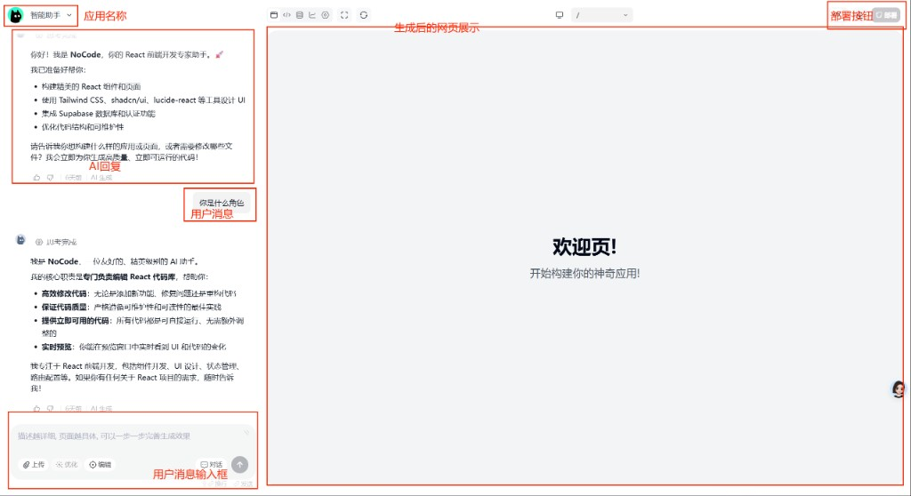

---

### 图 2 — 主页下方作品列表参考

**文件：** `02-prototype-home-bottom.png`  
**对话：** D-1（14:33）  
**内容描述：**

- 「我的作品」「精选案例」卡片网格布局
- **借鉴点：** HomeView 下半部分结构

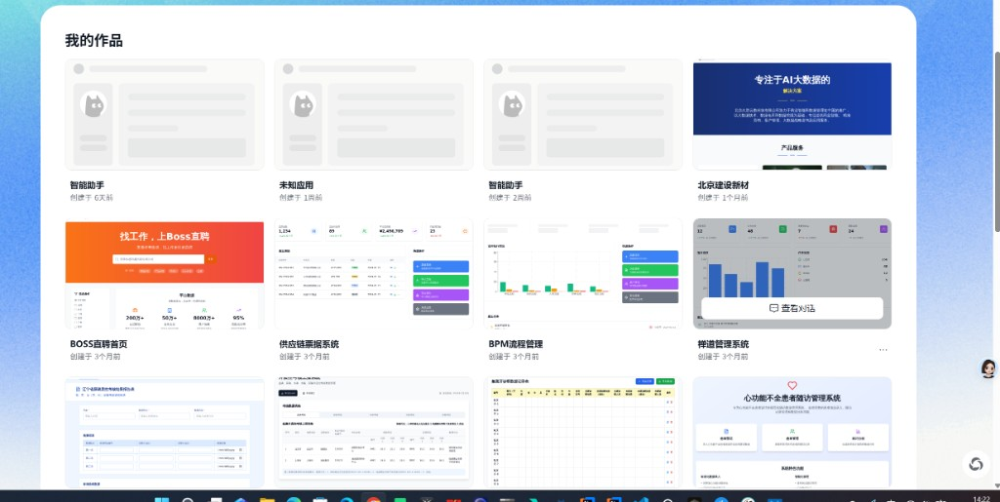

---

### 图 3 — 对话页布局参考

**文件：** `03-prototype-chat-page.png`  
**对话：** D-1 / D-2  
**内容描述：**

- 左右分栏对话页，输入区在底部
- **借鉴点：** AppChatView 整体布局

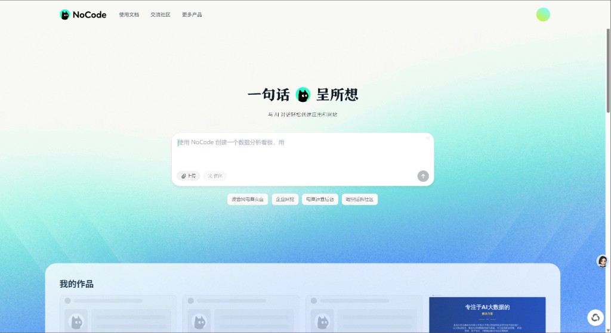

---

### 图 4 — 前端没有流式输出

**文件：** `04-no-stream-output.png`  
**对话：** E-3（15:12）  
**用户原话：**「前端没有流式输出」  
**内容描述：**

- 应用名「电商运营后台」
- 用户蓝色气泡已发送，AI 回复区空白小框
- 底部输入框正常

**对应问题：** [问题 1](#问题-1前端没有流式输出)

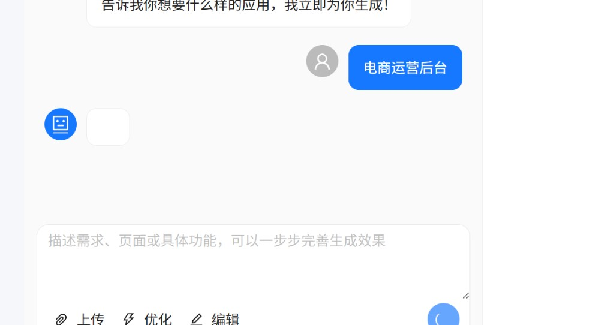

---

### 图 5 — 生成失败

**文件：** `05-generate-failed.png`  
**对话：** E-5  
**用户原话：**「生成失败」  
**内容描述：** 生成过程中断/报错界面

**对应问题：** [问题 2](#问题-2生成失败--closed)

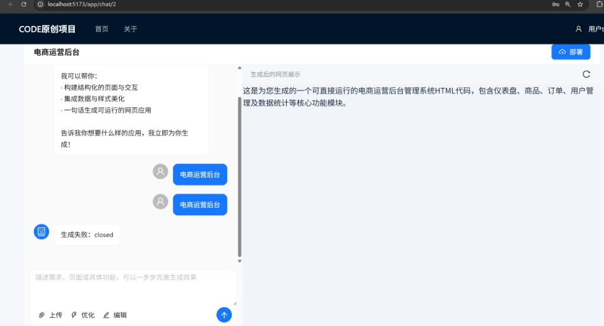

---

### 图 6 — 预览 Spring 404「乱码」

**文件：** `06-preview-garbled.png`  
**对话：** E-7  
**用户原话：**「网页右侧展示显示乱码」  
**内容描述：**

- 左：生成的 HTML/JS 源码（电商运营后台，`console.log('✅ 电商运营后台已加载(原生)')`）
- 右：Spring Whitelabel Error Page，404，`No static resource html_2`

**对应问题：** [问题 3](#问题-3预览-spring-404html_2)

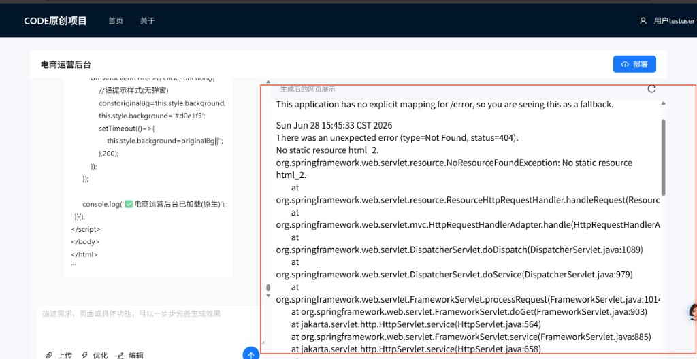

---

### 图 7 — Vue 工程设计参考（NoCode 思考 UI）

**文件：** `07-vue-design-ref-1.png`  
**对话：** G-1（工程项目生成需求 + 4 图）  
**内容描述：** NoCode「思考中…」可折叠面板、工具调用进度

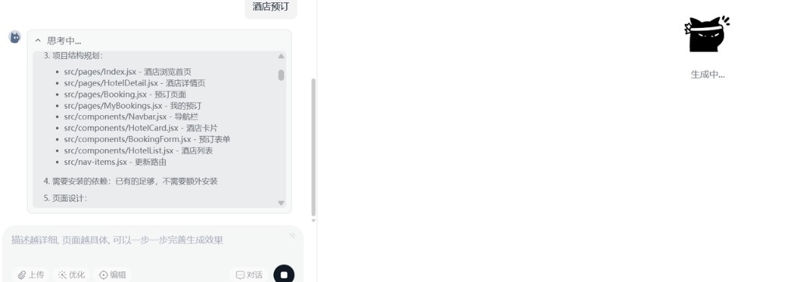

---

### 图 8 — Vue 工程设计参考 2

**文件：** `08-vue-design-ref-2.png`  
**对话：** G-1  
**内容描述：** Agent 执行阶段、文件保存列表

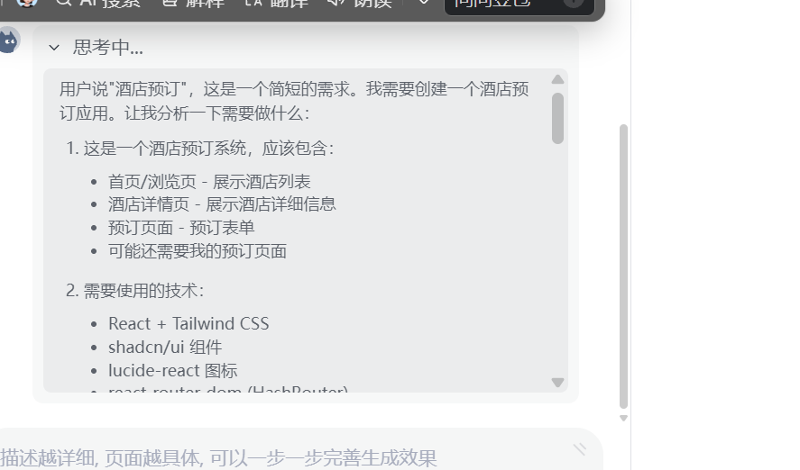

---

### 图 9 — Vue 工程设计参考 3

**文件：** `09-vue-design-ref-3.png`  
**对话：** G-1  
**内容描述：** 多文件生成进度、右侧预览区

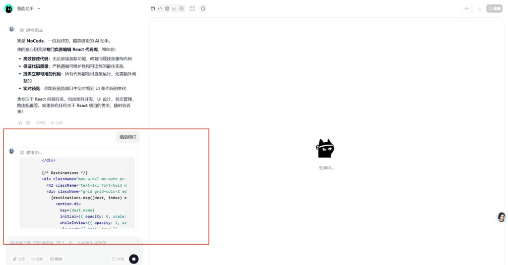

---

### 图 10 — Vue 工程设计参考 4 / Agent 模式

**文件：** `13-vue-design-ref-4.png`  
**对话：** G-1  
**内容描述：** Agent 模式说明、系统提示词相关 UI

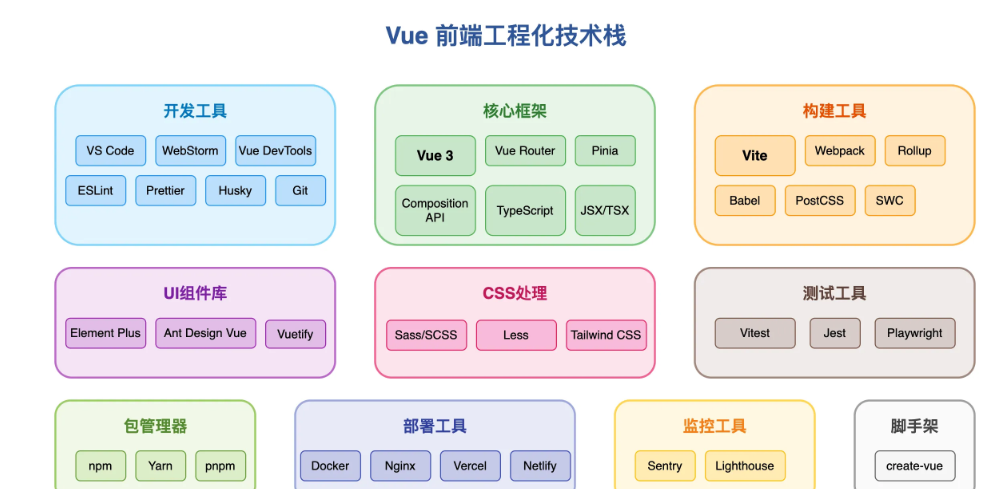

---

### 图 11 — Vue 预览 404 + 左侧 JSON

**文件：** `10-vue-garbled-preview.png`  
**对话：** G-5  
**用户原话：**「vue工程生成前端，生成后的网页展示为乱码」  
**内容描述：**

- 左：`package.json` 全文（data-dashboard 项目依赖）
- 右：404 `No static resource vue_project_4/dist/index.html`

**对应问题：** [问题 5](#问题-5vue-聊天区-tool-call-json-乱码)、[问题 7](#问题-7vue-dist-预览-404)

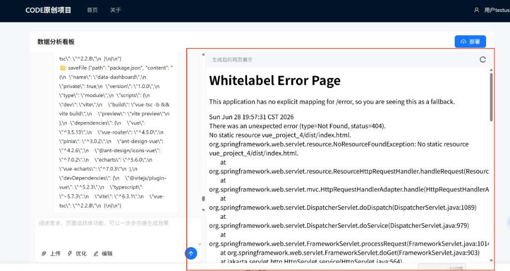

---

### 图 12 — Vue 构建出错

**文件：** `11-vue-build-error.png`  
**对话：** G-7  
**用户原话：**「出错」  
**内容描述：** npm build 或依赖安装失败界面

**对应问题：** [问题 6](#问题-6npm-etarget-icons-vue702)

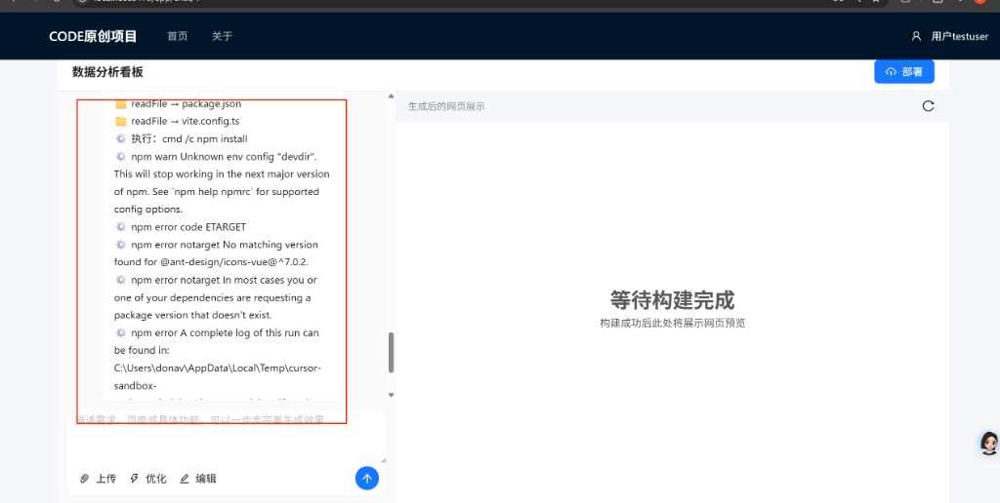

---

### 图 13 — Vue 预览右侧空白

**文件：** `12-vue-preview-blank.png`  
**对话：** G-8  
**用户原话：**「右侧没有显示」  
**内容描述：**

- 应用「数据分析看板」
- 左：AI 列出 ECharts/AntDesignVue/Pinia/VueRouter；提示「工程上下文未初始化」
- 中：build 日志 `3744 modules transformed`，dist 文件大小
- 右：**空白 iframe**（红框标注「生成后的网页展示」）

**对应问题：** [问题 8](#问题-8vue-iframe-预览空白)、[问题 9](#问题-9第二-turn-appid-未设置)

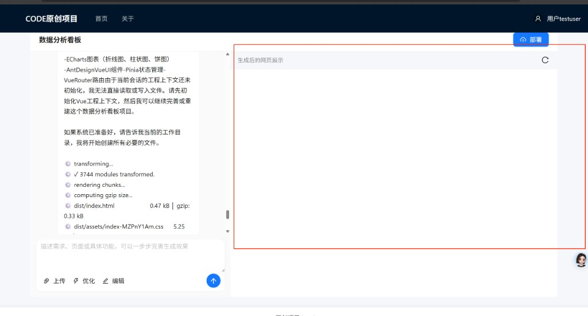

---

## 九、Git / GitHub / 生产部署

### 9.1 Git 提交明细

#### Commit 1：`dcb83c7`

```
Initial commit: CODE AI app generation platform (Vue3 + Spring Boot).
```

- 143 files，16714 insertions
- 含 client/、server/、deploy/、docs/ 教程初版
- 已移除 application.yml 硬编码 API Key
- 根目录 .gitignore（node_modules、target、tmp、dist）

#### Commit 2：`0867f3a`

```
Fix deploy script for remote setup and add deployment helper scripts.
```

- `deploy/deploy.py`：mkdir nginx、docker-compose 兼容、GBK 安全输出、移除 default 站点
- `deploy/nginx-code-student-pro.conf`：`default_server`
- 新增 `deploy/check_remote.py`、`deploy/finish_deploy.py`

### 9.2 GitHub

| 项 | 值 |
|----|-----|
| 账号 | JIDoctor-alt |
| 仓库 | https://github.com/JIDoctor-alt/java_student_pro |
| 可见性 | public |
| 远程状态 | 空仓库（size=0） |
| 本地领先 | 2 commits 未 push |
| push 失败原因 | git HTTPS → github.com:443 超时/Connection reset |
| gh API | 可用（repo create 成功） |
| SSH push | deploy key 仅授权 test-js 仓库，不可用 |

**推荐后续操作：**

```powershell
cd D:\cursor-workspace\java_student_pro
# 使用新 Token（轮换后）
$env:GH_TOKEN='你的新Token'
gh auth setup-git
git push -u origin main
```

### 9.3 生产部署明细

**deploy.py 流程：**

```
1. 本地 mvnw clean package -Dmaven.test.skip=true
2. 本地 npm run build（client）
3. SSH 连接服务器
4. SFTP 上传：
   - server.jar → /opt/code-student-pro/server.jar
   - client/dist → /opt/code-student-pro/frontend/
   - sql/*.sql → /opt/code-student-pro/sql/
   - docker-compose.yml、nginx conf、systemd service
5. 远程脚本：
   - 安装 docker/java/nginx/node（如缺失）
   - docker-compose up -d（MySQL + Redis）
   - systemctl enable --now code-student-pro
   - nginx -t && restart
```

**已确认上传至服务器：**

```
/opt/code-student-pro/
├── server.jar          (~59MB)
├── frontend/           (Vue dist)
├── sql/
├── docker-compose.yml
├── data/
└── tmp/

/etc/nginx/conf.d/code-student-pro.conf
/etc/systemd/system/code-student-pro.service
```

**未完成项：**

- `code-student-pro.service` → inactive
- code-mysql / code-redis 容器未运行
- nginx default 站点仍返回 Welcome to nginx（需 `rm sites-enabled/default`）

---

## 十、源码文件全清单

### 10.1 后端 Java（73 个）

<details>
<summary>点击展开完整列表</summary>

```
ServerApplication.java
ai/AiCodeGeneratorService.java
ai/VueProjectAgentService.java
ai/model/HtmlCodeResult.java
ai/model/MultiFileCodeResult.java
annotation/AuthCheck.java
aop/AuthInterceptor.java
common/BaseResponse.java, DeleteRequest.java, ErrorCode.java, PageRequest.java, ResultUtils.java
config/AppProperties.java, CorsConfig.java, RedisSessionConfig.java, StaticResourceConfig.java, VueProjectAgentConfig.java
constant/AppConstant.java, UserConstant.java
controller/AiCodeGeneratorController.java, AppController.java, UserController.java
core/AiCodeGeneratorFacade.java
core/parser/CodeParser.java
core/saver/CodeFileSaverExecutor.java, CodeFileSaverTemplate.java, HtmlCodeFileSaverTemplate.java, MultiFileCodeFileSaverTemplate.java
core/vue/VueProjectBuildService.java, VueProjectCodegenExecutor.java, VueProjectContext.java, VueProjectFileTool.java, VueProjectPackageNormalizer.java, VueProjectPathUtils.java, VueProjectPreviewPathFixer.java, VueProjectPreviewUtils.java, VueProjectStreamCallback.java
exception/BusinessException.java, GlobalExceptionHandler.java, ThrowUtils.java
generator/MyBatisFlexCodeGenerator.java
mapper/AppMapper.java, ChatHistoryMapper.java, UserMapper.java
model/dto/app/* (5), model/dto/chat/* (1), model/dto/user/* (5)
model/entity/App.java, ChatHistory.java, User.java
model/enums/ChatMessageTypeEnum.java, CodeGenTypeEnum.java, UserRoleEnum.java
model/vo/AppVO.java, ChatHistoryCursorPageVO.java, ChatHistoryVO.java, LoginUserVO.java, UserVO.java
service/AppService.java, ChatHistoryService.java, UserService.java
service/impl/AppServiceImpl.java, ChatHistoryServiceImpl.java, UserServiceImpl.java
```

</details>

### 10.2 前端核心文件

```
layouts/BasicLayout.vue
components/GlobalHeader.vue, GlobalFooter.vue, AppCard.vue
views/HomeView.vue, AppChatView.vue, AppManageView.vue
views/user/UserLoginView.vue, UserRegisterView.vue, UserManageView.vue
api/app.ts, user.ts, types.ts
stores/loginUser.ts
utils/sse.ts
request.ts, router/index.ts, main.ts, App.vue
```

### 10.3 资源与部署

```
server/.../resources/sql/create_table.sql
server/.../resources/sql/create_app_table.sql
server/.../resources/sql/create_chat_history_table.sql
server/.../resources/prompt/codegen-html-system-prompt.txt
server/.../resources/prompt/codegen-multi-file-system-prompt.txt
server/.../resources/prompt/codegen-vue-project-system-prompt.txt
server/.../resources/application.yml
server/.../resources/application-prod.yml
deploy/deploy.py, finish_deploy.py, check_remote.py
deploy/docker-compose.yml, nginx-code-student-pro.conf, code-student-pro.service, README.md
client/.env.production
docs/CODE原创项目-开发教程.md
docs/CODE原创项目-聊天记录-2026-06-28.md
docs/chat-images/*.png (13)
```

---

## 十一、待办与风险提示

### 11.1 待办（按优先级）

| 优先级 | 事项 | 命令/操作 |
|--------|------|-----------|
| **P0** | 轮换 GitHub Token | GitHub Settings → Developer settings → Tokens |
| **P0** | 修改服务器 root 密码 | 云平台控制台或 passwd |
| **P0** | push 代码到 GitHub | `git push -u origin main` |
| **P1** | 完成生产部署收尾 | `$env:DEPLOY_PASSWORD='...'; python deploy/finish_deploy.py` |
| **P1** | 验证生产站点 | 访问 http://124.70.195.81/ |
| **P2** | Vue 多轮对话回归测试 | 同一 app 第二 turn 增量修改 |
| **P3** | 将本文档一并 push | 随 main 分支推送 |

### 11.2 安全风险提示

| 风险 | 说明 | 建议 |
|------|------|------|
| Token 泄露 | 会话中明文发送 ghp_... | 立即作废并重建 Token |
| 服务器密码泄露 | 会话中两次明文发送 | 立即修改密码 |
| 生产 MySQL 默认密码 | application-prod 默认 root | 部署时改 MYSQL_PASSWORD |
| API Key | 曾硬编码于 application.yml | 已移除，仅用环境变量 |

### 11.3 已知限制

1. **Vue 工程生成较慢**：需多轮 tool-call + npm install + build，单次可能 3–10 分钟
2. **服务器端口冲突**：同机 silver-guard 占用 3316/6389，本项目 docker 用 3306/6379（需确认不冲突）
3. **Git push 网络**：gh API 可用但 git HTTPS 不稳定，可试 VPN 或 SSH（需添加 deploy key 到本仓库）
4. **Windows 开发**：Vue build 在 Windows 上需 `npm.cmd`；deploy.py 已适配

---

## 附录 A：对话消息索引（44 条）

| # | 时间 | 用户消息摘要 | 截图 |
|---|------|--------------|------|
| 1 | 12:38 | 全局基础布局需求 | — |
| 2 | 12:42 | 确认创建布局文件 | — |
| 3 | 12:51 | 用户模块完整需求 | — |
| 4 | 12:55 | Session + MySQL + RESTful | — |
| 5 | 13:10 | Spring 配置与依赖 | — |
| 6 | 13:12 | @AuthCheck AOP 权限 | — |
| 7 | 13:15 | 可以运行了吗 | — |
| 8 | 13:17 | docker 有 mysql（×2） | — |
| 9 | 13:42 | MyBatis Flex 文档链接 | — |
| 10 | 13:48 | 用户名密码是多少 | — |
| 11 | 14:05 | AI 生成方案（2 模式+SSE） | — |
| 12 | 14:33 | 应用管理需求+原型（×2） | 占位 |
| 13 | 14:41 | 仅截图 | 图1-3 |
| 14 | 14:51 | 补齐部署+管理页 | — |
| 15 | 15:06 | 后端运行了吗 | — |
| 16 | 15:09 | 重新运行 | — |
| 17 | 15:12 | 前端没有流式输出 | 图4 |
| 18 | — | 实时查看应用效果 | — |
| 19 | 15:31 | 继续 | — |
| 20 | — | 生成失败 | 图5 |
| 21 | — | 仅截图 | — |
| 22 | — | 右侧乱码 | 图6 |
| 23 | — | 导出 md 教程 | — |
| 24 | — | 对话历史模块需求（×2） | — |
| 25 | — | 写入开发教程 | — |
| 26 | — | 工程项目生成+4图 | 图7-10 |
| 27 | — | 继续（实现 Vue 工程） | — |
| 28 | — | 运行 | — |
| 29 | — | 后端没有运行 | — |
| 30 | — | Vue 预览乱码 | 图11 |
| 31 | — | 重启后端 | — |
| 32 | — | 出错 | 图12 |
| 33 | — | 右侧没有显示 | 图13 |
| 34 | — | 部署到 124.70.195.81 | — |
| 35 | — | 上传 GitHub（×2） | — |
| 36 | — | 再次提供服务器密码 | — |
| 37 | — | 继续部署 | — |
| 38 | — | 上传 GitHub | — |
| 39 | — | 提供 GitHub Token | — |
| 40 | — | 整理开发教程 | — |
| 41 | — | 聊天记录越详细越好 | — |

---

## 附录 B：相关链接

| 名称 | URL |
|------|-----|
| LangChain4j 文档 | https://docs.langchain4j.dev/intro/ |
| DeepSeek API | https://api-docs.deepseek.com/zh-cn/ |
| MyBatis Flex | https://mybatis-flex.com/zh/intro/getting-started.html |
| GitHub 仓库 | https://github.com/JIDoctor-alt/java_student_pro |
| 生产站点（目标） | http://124.70.195.81/ |
| 本地前端 | http://localhost:5173 |
| 本地 API | http://localhost:8123/api |
| 接口文档 | http://localhost:8123/api/doc.html |

---

*文档版本：详尽版 v2 · 整理时间：2026-06-28 · CODE 原创项目 by ZhenQ*
